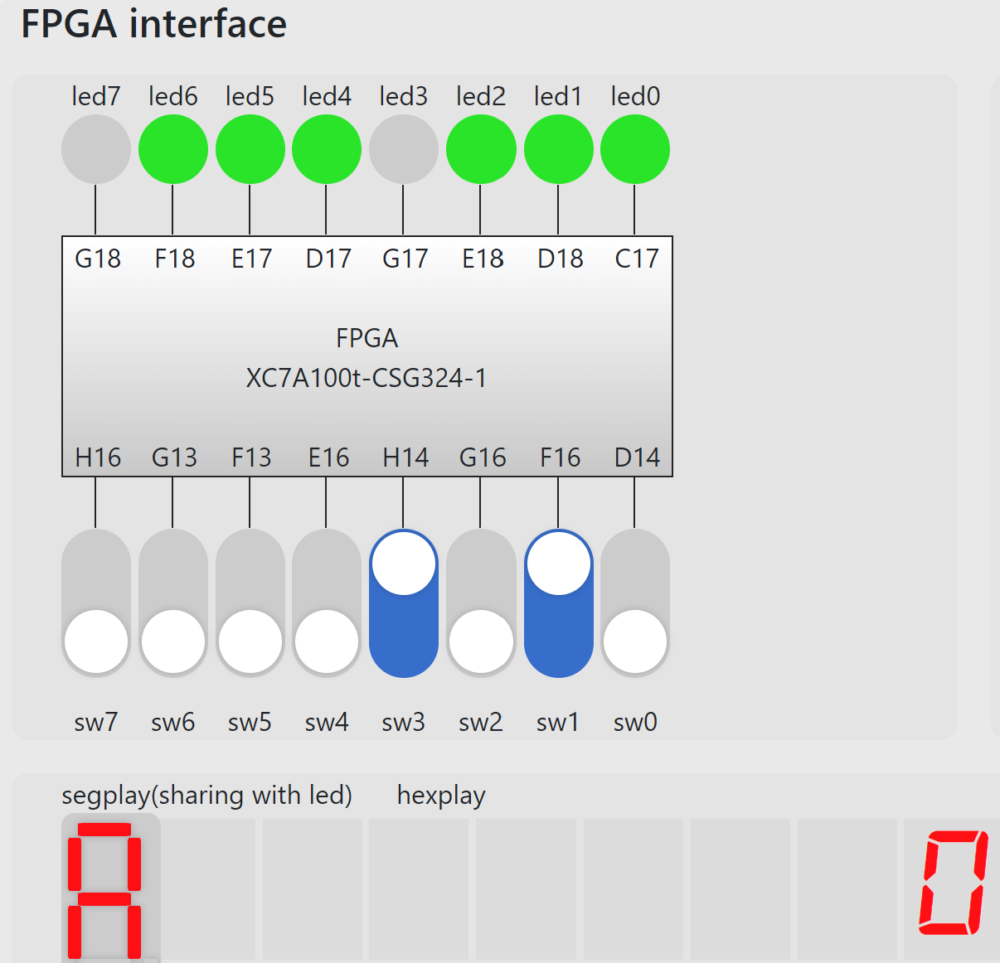
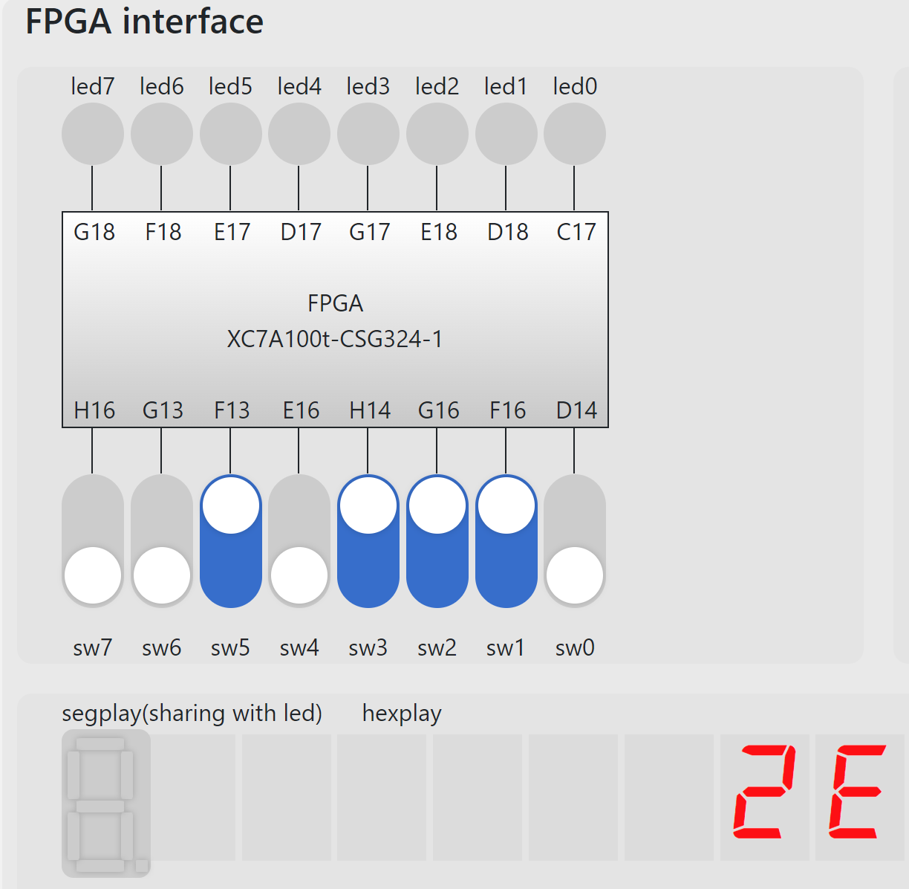
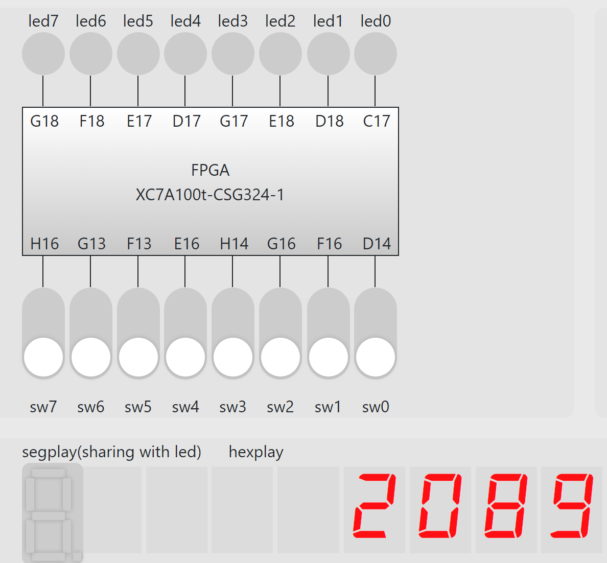

  

<div style="text-align:center;font-size:2em;font-weight:bold">中国科学技术大学计算机学院</div>


<div style="text-align:center;font-size:2em;font-weight:bold">《数字电路实验报告》</div>


<div style="display: flex;flex-direction: column;align-items: center;font-size:2em">
<div>
<p>实验题目：FPGA平台及IP核的使用 </p>
<p>学生姓名：叶子昂</p>
<p>学生学号：PB20020586</p>
<p>完成时间：2021年12月6日</p>
</div>
</div>


<div style="page-break-after:always"></div>

#### 实验题目
**FPGA平台及IP核的使用**

#### 实验目的
* 熟悉FPGA在线实验平台的结构及使用
* 掌握FPGA开发各关键环节
* 学会使用IP核
* 能够灵活运用IP核及其他电路实现特殊功能

#### 实验环境
* 有Windows系统的电脑，能连接校园网
* FPGAOL平台
* 本地的vivado，Logisim

#### 实验题目
**题目一**
> 例化一个 16*8bit 的 ROM，并对其进行初始化，输入端口由4 个开关控制，输出端口连接到七段数码管上（七段数码> 管与 LED 复用相同的一组管脚），控制数码管显示与开关相对应的十六进制数字，例如四个开关输入全为零时，数码管> 显示“0”，输入全为 1 时，数码管显示“F” 。

* 首先使用vivado生成一个ROM

* 初始化ROM使之与七段显示数码管输出的16进制相对应
    ```verilog
    memory_initialization_radix=16;
    memory_initialization_vector=3f 6 5b 4f 66 6d 7d 7 7f 6f 77 7c 39 5e 79 71;
    ```
* 编写Verilog代码调用该模块，并使4位的输入与输出相对应
* 约束管脚，约束文件部分内容如下：
   ```verilog
    set_property -dict { PACKAGE_PIN C17   IOSTANDARD LVCMOS33 } [get_ports { spo[0] }];
    set_property -dict { PACKAGE_PIN D18   IOSTANDARD LVCMOS33 } [get_ports { spo[1] }];
    set_property -dict { PACKAGE_PIN E18   IOSTANDARD LVCMOS33 } [get_ports { spo[2] }];
    set_property -dict { PACKAGE_PIN G17   IOSTANDARD LVCMOS33 } [get_ports { spo[3] }];
    set_property -dict { PACKAGE_PIN D17   IOSTANDARD LVCMOS33 } [get_ports { spo[4] }];
    set_property -dict { PACKAGE_PIN E17   IOSTANDARD LVCMOS33 } [get_ports { spo[5] }];
    set_property -dict { PACKAGE_PIN F18   IOSTANDARD LVCMOS33 } [get_ports { spo[6] }];
    set_property -dict { PACKAGE_PIN G18   IOSTANDARD LVCMOS33 } [get_ports { spo[7] }];
   
    ## FPGAOL SWITCH
    set_property -dict { PACKAGE_PIN D14   IOSTANDARD LVCMOS33 } [get_ports { a[0] }];
    set_property -dict { PACKAGE_PIN F16   IOSTANDARD LVCMOS33 } [get_ports { a[1] }];
    set_property -dict { PACKAGE_PIN G16   IOSTANDARD LVCMOS33 } [get_ports { a[2] }];
    set_property -dict { PACKAGE_PIN H14   IOSTANDARD LVCMOS33 } [get_ports { a[3] }];
   ```
* 利用Vivado综合生成bitstream文件并烧写进入FPGA在线平台。结果如下：
    
    显示正确。

**题目二**
> 采用 8 个开关作为输入，两个十六进制数码管作为输出，采用时分复用的> 方式将开关的十六进制数值在两个数码管上显示出来，例如高四位全为 1，> 低四位全为 0 时，数码管显示“F0”。

* 16进制数码管一次只能接受1个四位显示信号和一个三位选择信号，为了能显示两个16进制数，需要在不同的时间段输入两个16进制数的显示信息和选择信息。同时时间段变化不能太快否则只会显示一个16进制数。编写代码如下：
  ```verilog
    module hexdisplay (
    input [7:0] IN, 
    input clk,rst,
    output reg [3:0] OUT,
    output reg [2:0] selsct
    );
        reg enable;
        wire clk_n,locked;
        clk_wiz_0 	      clk_wiz_0_insrt(.clk_in1(clk),.clk_out1(clk_n),.reset(rst),.locked(locked));
        always@(*)
        begin
            OUT<=(enable)?IN[7:4]:IN[3:0];
            selsct<=(enable)?(3'b1):(3'b0);
        end
        always@(posedge clk_n or posedge rst)
        begin
            if(rst==1'b1)
            begin
                enable<=1'b0;
                OUT<=1'b0;
            end
            else 
            begin
                enable<=enable+1'b1;
            end
        end
    endmodule
  ```
* 编写管脚约束文件，部分如下：
    ```verilog
    set_property -dict { PACKAGE_PIN E3    IOSTANDARD LVCMOS33 } [get_ports { clk }]; 
    ##IO_L12P_T1_MRCC_35 Sch=clk100mhz
    #create_clock -add -name sys_clk_pin -period 10.00 -waveform {0 5} [get_ports {CLK100MHZ}];
    # FPGAOL BUTTON & SOFT_CLOCK
    set_property -dict { PACKAGE_PIN B18   IOSTANDARD LVCMOS33 } [get_ports { rst }];
    set_property -dict { PACKAGE_PIN D14   IOSTANDARD LVCMOS33 } [get_ports { IN[0] }];
    set_property -dict { PACKAGE_PIN F16   IOSTANDARD LVCMOS33 } [get_ports { IN[1] }];
    set_property -dict { PACKAGE_PIN G16   IOSTANDARD LVCMOS33 } [get_ports { IN[2] }];
    set_property -dict { PACKAGE_PIN H14   IOSTANDARD LVCMOS33 } [get_ports { IN[3] }];
    set_property -dict { PACKAGE_PIN E16   IOSTANDARD LVCMOS33 } [get_ports { IN[4] }];
    set_property -dict { PACKAGE_PIN F13   IOSTANDARD LVCMOS33 } [get_ports { IN[5] }];
    set_property -dict { PACKAGE_PIN G13   IOSTANDARD LVCMOS33 } [get_ports { IN[6] }];
    set_property -dict { PACKAGE_PIN H16   IOSTANDARD LVCMOS33 } [get_ports { IN[7] }];
    ## FPGAOL HEXPLAY
    set_property -dict { PACKAGE_PIN A14   IOSTANDARD LVCMOS33 } [get_ports { OUT[0] }];
    set_property -dict { PACKAGE_PIN A13   IOSTANDARD LVCMOS33 } [get_ports { OUT[1] }];
    set_property -dict { PACKAGE_PIN A16   IOSTANDARD LVCMOS33 } [get_ports { OUT[2] }];
    set_property -dict { PACKAGE_PIN A15   IOSTANDARD LVCMOS33 } [get_ports { OUT[3] }];
    set_property -dict { PACKAGE_PIN B17   IOSTANDARD LVCMOS33 } [get_ports { selsct[0] }];
    set_property -dict { PACKAGE_PIN B16   IOSTANDARD LVCMOS33 } [get_ports { selsct[1] }];
    set_property -dict { PACKAGE_PIN A18   IOSTANDARD LVCMOS33 } [get_ports { selsct[2] }];
    
    ```
* 利用Vivado综合生成bitstream文件，烧写进入FPGA平台，结果如下：
  
  显示正确。

**题目三**
> 利用本实验中的时钟管理单元或周期脉冲技术， 设计一个精度为 0.1 秒的> 计时器，用 4 位数码管显示出来，数码管从高到低，分别表示分钟、秒钟> 十位、秒钟个位、十分之一秒，该计时器具有复位功能（可采用按键或开关> 作为复位信号） ，复位时计数值为 1234，即 1 分 23.4 秒
* 计时器的更改以0.1s为单位，需要一个10HZ的时钟。先用IP核降频为10MHZ再用计数的方法降频为10HZ，要显示4个16进制数码管，需要2位的使能信号实现分时输出不同信号。这些信号模块如下：
    ```verilog
    clk_wiz_0 clk_wiz_0_insrt(.clk_in1(clk),.clk_out1(clk_n),.reset(rst),.locked(locked));
    always@(posedge clk_n or posedge rst)                     
    begin
        if(rst)
        begin
            cout<=20'b0;
            enable<=2'b0;
        end
        else
        begin
            if(cout>=20'd999999)
            cout<=20'b0;
            else cout=cout+20'b1;
            enable<=enable+2'b1;
        end
    end
    assign pulse_10hz=(cout==20'd999999);
    ```
* 分时信号选择模块：
    ```verilog
    always@(*)
    begin
        case(enable)
        2'd0:begin out=outst; selsct=3'd0; end
        2'd1:begin out=outsg; selsct=3'd1; end
        2'd2:begin out=outss; selsct=3'd2; end
        2'd3:begin out=outm; selsct=3'd3; end
        default:begin out=4'b0; selsct=3'd0; end
        endcase
    end
    ```
* 计时器下一位需在上一位产生进位时才会产生变化从左到右分别为16进，6进，10进，10进。模块如下：
    ```verilog
    always@(posedge clk_n or posedge rst)
    begin
        if(rst==1'b1)
        begin
            outm<=4'd1;
            outss<=4'd2;
            outsg<=4'd3;
            outst<=4'd4;
        end
        else
        begin
            if(pulse_10hz)
            begin
                if(outst>=4'd9)
                begin
                    outst<=4'b0;
                    if(outsg>=4'd9)
                    begin
                        outsg<=4'b0;                                                                                                                     
                        if(outss>=4'd5)
                        begin
                            outss<=4'b0;
                            outm<=outm+4'b1;
                        end
                        else outss<=outss+4'b1;
                    end
                    else outsg<=outsg+4'b1;
                end
                else outst<=outst+4'b1;
            end
        end
    end
    ```
* 代码整体如下：
    ```verilog
    module time_count (
    input clk,rst,
    output reg [3:0] out,
    output reg [2:0] selsct
    );
        wire clk_n,locked;
        wire pulse_10hz;
        reg [3:0] outm ;reg [3:0] outss;reg [3:0] outsg;reg [3:0] outst;
        reg [1:0] enable;
        reg [19:0] cout;
        clk_wiz_0 clk_wiz_0_insrt(.clk_in1(clk),.clk_out1(clk_n),.reset(rst),.locked(locked));
        always@(*)
        begin
            case(enable)
            2'd0:begin out=outst; selsct=3'd0; end
            2'd1:begin out=outsg; selsct=3'd1; end
            2'd2:begin out=outss; selsct=3'd2; end
            2'd3:begin out=outm; selsct=3'd3; end
            default:begin out=4'b0; selsct=3'd0; end
            endcase
        end
        always@(posedge clk_n or posedge rst)                     
        begin
            if(rst)
            begin
                cout<=20'b0;
                enable<=2'b0;
            end
            else
            begin
                if(cout>=20'd999999)
                cout<=20'b0;
                else cout=cout+20'b1;
                enable<=enable+2'b1;
            end
        end
        assign pulse_10hz=(cout==20'd999999);
        always@(posedge clk_n or posedge rst)
        begin
            if(rst==1'b1)
            begin
                outm<=4'd1;
                outss<=4'd2;
                outsg<=4'd3;
                outst<=4'd4;
            end
            else
            begin
                if(pulse_10hz)
                begin
                    if(outst>=4'd9)
                    begin
                        outst<=4'b0;
                        if(outsg>=4'd9)
                        begin
                            outsg<=4'b0;                                                                                                                     
                            if(outss>=4'd5)
                            begin
                                outss<=4'b0;
                                outm<=outm+4'b1;
                            end
                            else outss<=outss+4'b1;
                        end
                        else outsg<=outsg+4'b1;
                    end
                    else outst<=outst+4'b1;
                end
            end
        end
    endmodule
    ```
* 管脚约束，部分文件如下：
    ```verilog
    set_property -dict { PACKAGE_PIN E3    IOSTANDARD LVCMOS33 } [get_ports { clk }]; #IO_L12P_T1_MRCC_35 Sch=clk100mhz
    #create_clock -add -name sys_clk_pin -period 10.00 -waveform {0 5} [get_ports {CLK100MHZ}];
    ## FPGAOL BUTTON & SOFT_CLOCK
    set_property -dict { PACKAGE_PIN B18   IOSTANDARD LVCMOS33 } [get_ports { rst }];
    set_property -dict { PACKAGE_PIN A14   IOSTANDARD LVCMOS33 } [get_ports { out[0] }];
    set_property -dict { PACKAGE_PIN A13   IOSTANDARD LVCMOS33 } [get_ports { out[1] }];
    set_property -dict { PACKAGE_PIN A16   IOSTANDARD LVCMOS33 } [get_ports { out[2] }];
    set_property -dict { PACKAGE_PIN A15   IOSTANDARD LVCMOS33 } [get_ports { out[3] }];
    set_property -dict { PACKAGE_PIN B17   IOSTANDARD LVCMOS33 } [get_ports { selsct[0] }];
    set_property -dict { PACKAGE_PIN B16   IOSTANDARD LVCMOS33 } [get_ports { selsct[1] }];
    set_property -dict { PACKAGE_PIN A18   IOSTANDARD LVCMOS33 } [get_ports { selsct[2] }];
    ```
* 利用Vivado生成bitstream文件，烧写观察结果：
    
    计数正常。

#### 总结与思考
* 本次实验的收获
* 本次实验的难易程度
* 本次实验的任务量
* 对本次实验的建议