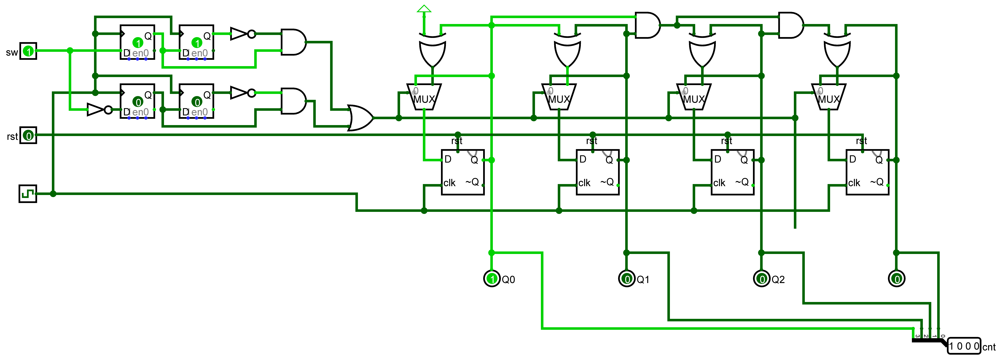
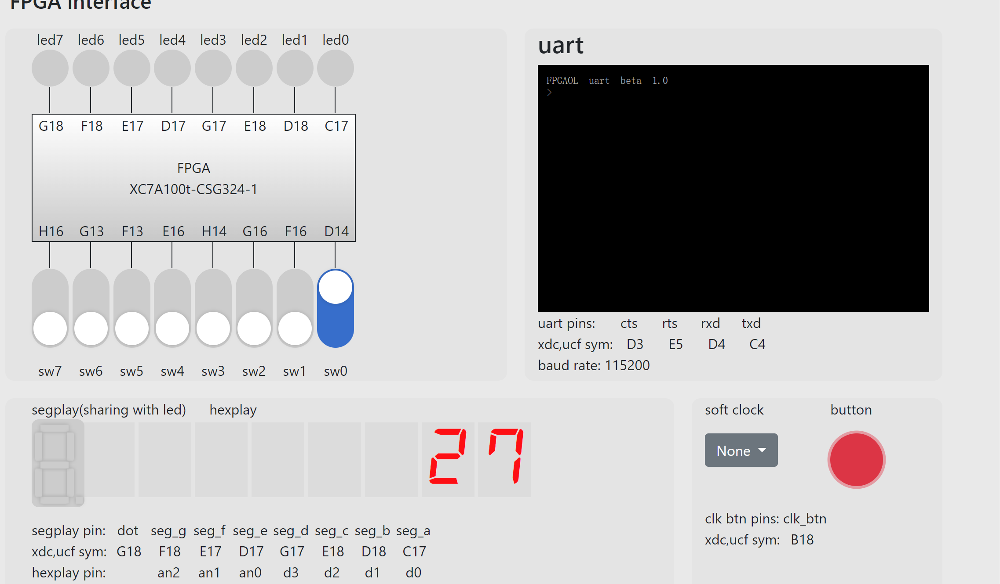
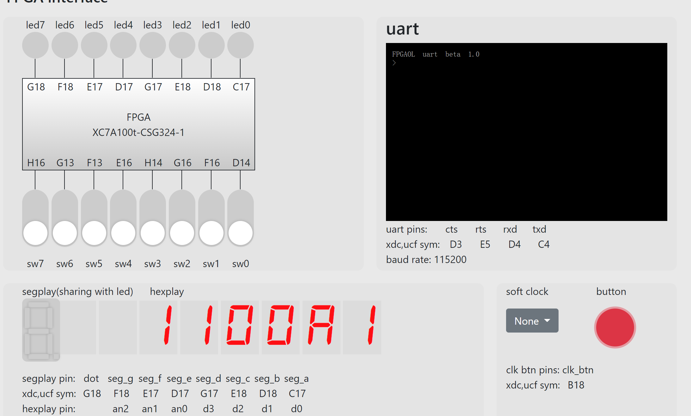

  

<div style="text-align:center;font-size:2em;font-weight:bold">中国科学技术大学计算机学院</div>


<div style="text-align:center;font-size:2em;font-weight:bold">《数字电路实验报告》</div>


<div style="display: flex;flex-direction: column;align-items: center;font-size:2em">
<div>
<p>实验题目：信号处理机有限状态机 </p>
<p>学生姓名：叶子昂</p>
<p>学生学号：PB20020586</p>
<p>完成时间：2021年12月13日</p>
</div>
</div>


<div style="page-break-after:always"></div>

#### 实验题目
**信息处理及有限状态机**
#### 实验目的
* 进一步熟悉FPGA在线实验平台的结构及使用
* 掌握几种常见信号处理方法
* 掌握有限状态机的设计方法
* 能够使用有限状态机设计功能电路

#### 实验环境
* 有Windows系统的电脑，能连接校园网
* FPGAOL平台
* 本地的vivado，Logisim

#### 实验题目
**题目一**：

> 在不改变电路功能和行为的前提下， 将前面 Step5 中的代码改写成三段式有限状态机的形式， 写出完整的 Verilog 代码 。 

* 按照有限状态机的三个部分改写Step5中的代码如下：

  ```verilog
  module test (
      input clk,rst,
      output led
  );
      reg [1:0] cnt;
      reg [1:0] cntnextstate;
      always@(*)
      begin
          cntnextstate=cnt+2'b1;
      end
      always@(posedge clk or posedge rst)
      begin
          if(rst)cnt<=2'b0;
          else cnt<=cntnextstate;
      end
      assign led=(cnt==2'b11)?1'b1:1'b0;
  endmodule
  ```

  

**题目二**：

> 请在 Logisim 中设计一个 4bit 位宽的计数器电路， 如下图所示， clk 信号为计数器时钟， 复位时（rst==1） 计数值为 0， 在输入信号 sw 电平发生变化时， 计数值 cnt 加 1， 即在 sw 信号上升沿时刻和下降沿时刻各触发一次计数操作， 其余时刻计数器保持不变。  

* 在前面实验的4bit位计数器的基础上检测sw的上升和下降沿，检测到时分别计数一次，其余时候保持cnt不变(通过选择器完成)。
    

**题目三**：

> 设计一个 8 位的十六进制计数器， 时钟采用板载的 100MHz时钟， 通过 sw[0]控制计数模式， 开关为 1 时为累加模式， 为 0 时为递减模式， 按键控制计数， 按下的瞬间根据开关的状态进行累加或递减计数。 计数值用数码管显示， 其复位值为“1F” 。  

* 通过“物理”按键控制电路需要去毛刺和取上升沿

* 100MHZ频率太高会使得结果无法正常输出，需要降频用于输出显示信号

* 代码如下：

  ```verilog
  module counter (
      input clk,button,
      input [2:0] sw,
      output reg [3:0] out,
      output reg [2:0] selsct
  );
      wire clk_n;
      wire button_n;
      wire button_edge;
      reg enable;
      reg [7:0] result;
      //信号处理
      jtrclr clr(.clk(clk),.button(button),.button_n(button_n));
      signal_edge cedge(.clk(clk),.button(button_n),.button_edge(button_edge));
      clk_wiz_0 clk_wiz_0_insrt(.clk_in1(clk),.clk_out1(clk_n),.reset(sw[1]),.locked(locked));//clk_n用于输出
      //计数模块
      always@(posedge clk or posedge sw[1])
      begin
          if(sw[1])
          begin
              result<=8'h1f;
          end
          else
          begin
              if(button_edge)
              begin
                  if(sw[0]) result<=result+8'b1;
                  else result<=result-8'b1;
              end
          end
      end
      //输出信号选择模块
      always@(posedge clk_n or posedge sw[1])                     
      begin
          if(sw[1]) enable<=1'b0;
          else enable<=enable+1'b1;
      end
      always@(*)
      begin
          case(enable)
          1'b0:begin selsct=3'b0; out=result[3:0]; end
          1'b1:begin selsct=3'b1; out=result[7:4]; end
          default:begin selsct=3'b0; out=result[3:0]; end
          endcase
      end
  endmodule
  
  
  
  module jtrclr (//去毛刺
      input clk,button,
      output button_n
  );
      reg [3:0] cnt;
      always@(posedge clk)
      begin
          if(button==1'b0) cnt<=4'h0;
          else if(cnt<4'h8)cnt<=cnt+4'b1;
      end
      assign button_n=cnt[3];
  endmodule
  
  module signal_edge(//取上升沿
      input clk,button,
      output button_edge
  );
      reg button_r1,button_r2;
      always@(posedge clk)
      begin
          button_r1<=button;
      end
      always@(posedge clk)
      begin
          button_r2<=button_r1;
      end
      assign button_edge=button_r1&(~button_r2);
  endmodule
  ```

* vivado综合生成bit文件烧写到FPGA平台结果如下：
    


**题目四**

> 使用有限状态机设计一个序列检测电路， 并进行计数， 当检测到输入序列为“1100” 时， 计数器加一， 用一个数码管显示当前状态编码， 一个数码管显示检测到目标序列的个数， 用 4 个数码管显示最近输入的 4 个数值， 用 sw[0]进行数据的串行输入， 按键每按下一次将输入一次开关状态， 时钟采用板载的 100MHz 时钟。要求画出状态跳转图， 并在 FPGA 开发板上实现电路， 例如当输入“0011001110011”时， 目标序列个数应为2， 最近输入数值显示“0011”，状态机编码则与具体实现有关。  

* 首先画出状态图

* 列出状态表，发现e与a状态相同，可以状态化简。

* 最近输入数值在button按下时同步更新。

* 代码如下：

  ```verilog
  module check (
      input clk,button,
      input [1:0] sw,
      output reg [2:0] selsct,
      output reg [3:0] outdisplay
  );
      reg [3:0] cout;
      reg [3:0] outin;
      reg [15:0] outstate;
      reg [3:0] currentstate;
      reg [3:0] nextstate;
      reg [2:0] enable;
      wire clk_n;
      wire button_n;
      wire button_edge;
      //状态机状态
      parameter A = 4'ha;
      parameter B = 4'hb;
      parameter C = 4'hc;
      parameter D = 4'hd;
      //信号处理
      jtrclr clr(.clk(clk),.button(button),.button_n(button_n));
      signal_edge cedge(.clk(clk),.button(button_n),.button_edge(button_edge));
      clk_wiz_0 clk_wiz_0_insrt(.clk_in1(clk),.clk_out1(clk_n),.reset(sw[1]),.locked(locked));
      //生成次态
      always@(*)
      begin
          if(button_edge)
          begin
              case(currentstate)
              A:
              begin
                  if(sw[0]) nextstate=B;
                  else nextstate=A;
              end
              B:
              begin
                  if(sw[0]) nextstate=C;
                  else nextstate=A;
              end
              C:
              begin
                  if(sw[0]) nextstate=C;
                  else nextstate=D;
              end
              D:
              begin
                  if(sw[0]) nextstate=B;
                  else 
                  begin
                      nextstate=A;
                  end
              end
              default: nextstate=4'b0;
              endcase
          end
      end
      //计数
      always@(posedge clk or posedge sw[1])
      begin
          if(sw[1])
              cout<=4'b0;
          else
          begin
              if(button_edge&&currentstate==D&&~sw[0])cout<=cout+4'b1;
              else cout<=cout;
          end
      end
      //状态更新
      always @(posedge clk or posedge sw[1])
      begin
          if(sw[1])
          begin
              outstate<=16'b0;
              outin<=currentstate;
              currentstate<=A;kz
          end
          else
          begin
              outin<=currentstate;
              if(button_edge)
              begin
                  outstate[3:0]<=sw[0];
                  outstate[7:4]<=outstate[3:0];
                  outstate[11:8]<=outstate[7:4];
                  outstate[15:12]<=outstate[11:8];
                  currentstate<=nextstate;
              end
          end
      end
      //输出信号选择
      always@(posedge clk_n or posedge sw[1])                     
      begin
          if(sw[1])
              enable<=3'b0;
          else
              if(enable>=3'd5)enable<=3'b0;
              else enable<=enable+3'b1;
      end
      always@(*)
      begin
          case(enable)
          3'd0:begin outdisplay<=cout; selsct<=3'd0; end
          3'd1:begin outdisplay<=outin; selsct<=3'd1; end
          3'd2:begin outdisplay<=outstate[3:0]; selsct<=3'd2; end
          3'd3:begin outdisplay<=outstate[7:4]; selsct<=3'd3; end
          3'd4:begin outdisplay<=outstate[11:8]; selsct<=3'd4; end
          3'd5:begin outdisplay<=outstate[15:12]; selsct<=3'd5; end
          default:begin outdisplay<=cout; selsct<=3'd0; end
          endcase
      end
  endmodule
  
  
  
  
  module jtrclr (//去毛刺
      input clk,button,
      output button_n
  );
      reg [3:0] cnt;
      always@(posedge clk)
      begin
          if(button==1'b0) cnt<=4'h0;
          else if(cnt<4'h8)cnt<=cnt+4'b1;
      end
      assign button_n=cnt[3];
  endmodule
  
  module signal_edge(//取边沿
      input clk,button,
      output button_edge
  );
      reg button_r1,button_r2;
      always@(posedge clk)
      begin
          button_r1<=button;
      end
      always@(posedge clk)
      begin
          button_r2<=button_r1;
      end
      assign button_edge=button_r1&(~button_r2);
  endmodule
  ```
* vivado综合生成bit文件烧写进入FPGA平台观察结果如下：
    

#### 总结与思考
* 本次实验的收获
  * 通过本次实验的锻炼我进一步熟悉了解如何利用FPGA在线平台完成FPGA开发的流程。
  * 了解掌握了信号去毛刺，取信号边沿等常见的信号处理技巧。
  * 通过教程的学习熟悉掌握有限状态机的概念，设计流程，设计方法。
  * 能够利用有限状态机设计较为复杂的功能电路，将有限状态机的设计思想应用在电路设计中。
* 本次实验的难易程度
    本次实验涉及较难的有限状态机，题目较多难度较大。
* 本次实验的任务量
	本次实验题目较多，有限状态机的设计与实现也比较花时间。同时教程的新内容如信号处理技巧等也较多，总体任务量较大。
* 对本次实验的建议
	希望能将第九次实验换成外设或仅串口的使用方法，这样会对综合实验的完成有很大帮助，但看第十次实验的教程难以学会如何使用外设。