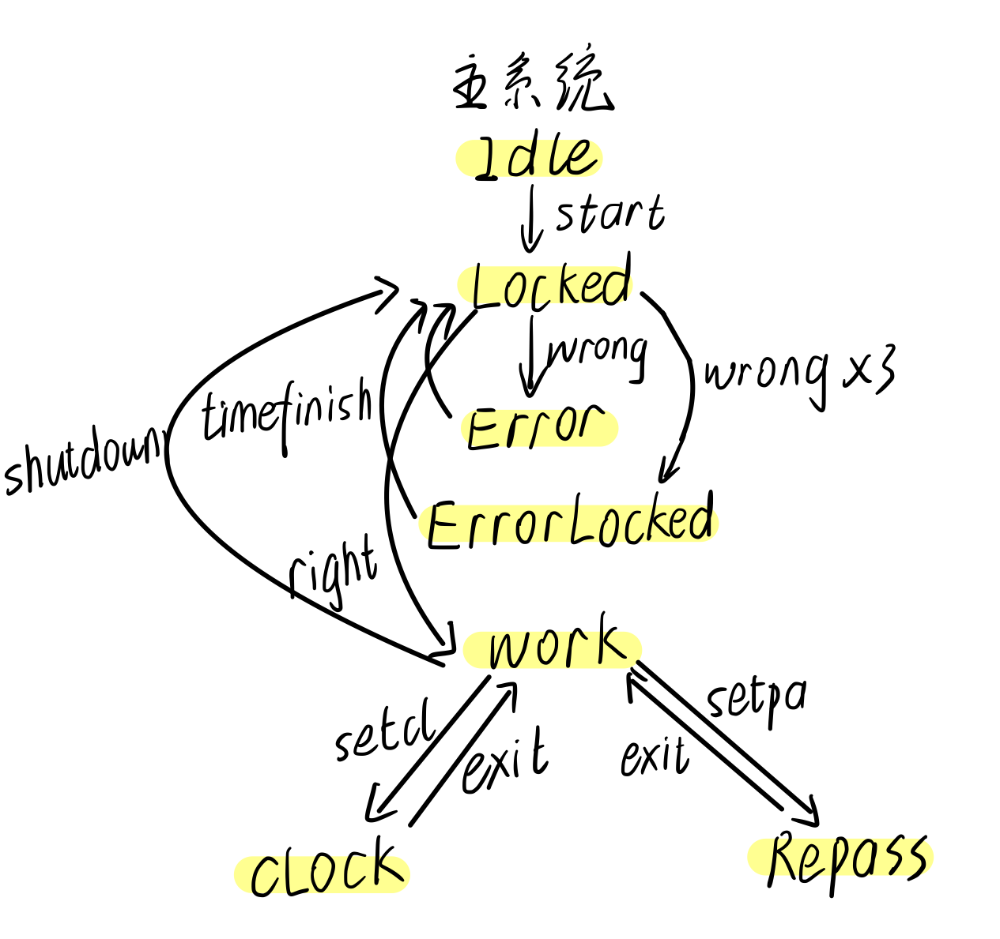
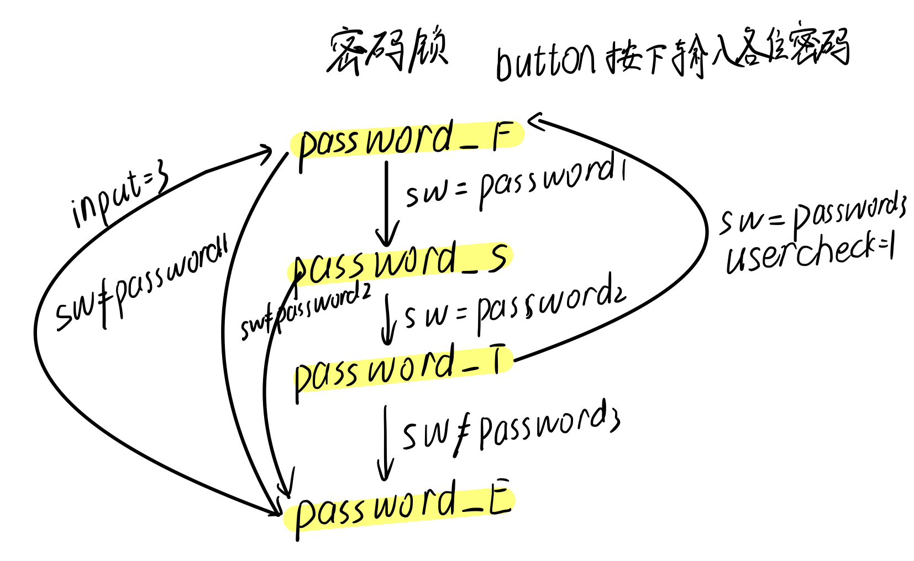
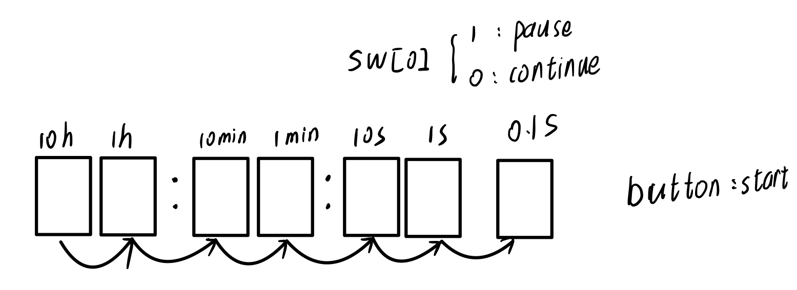
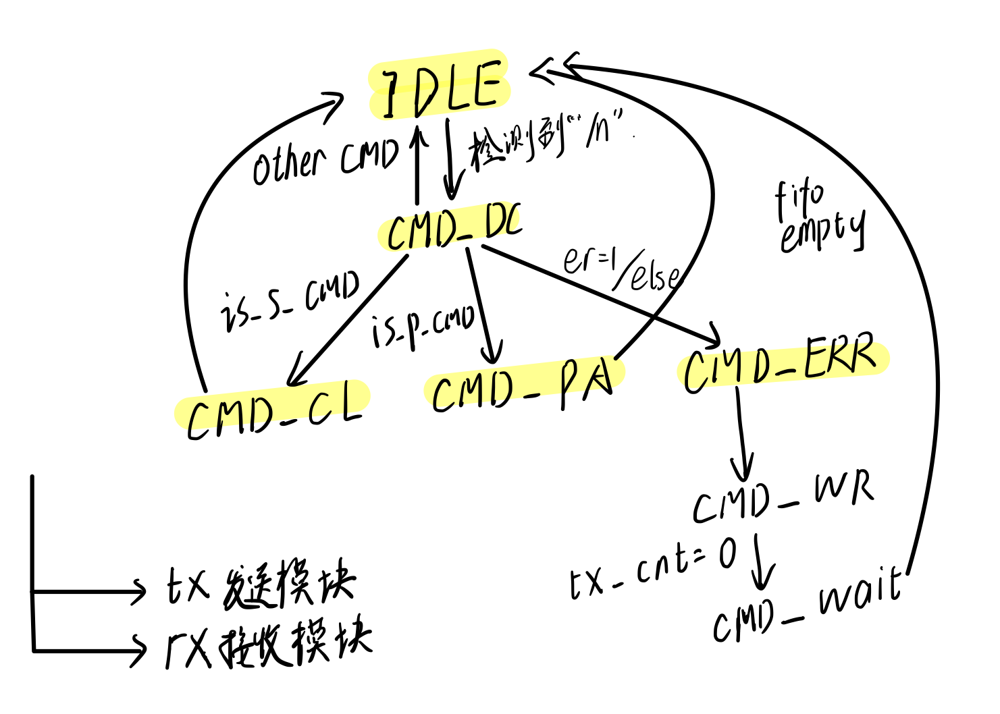
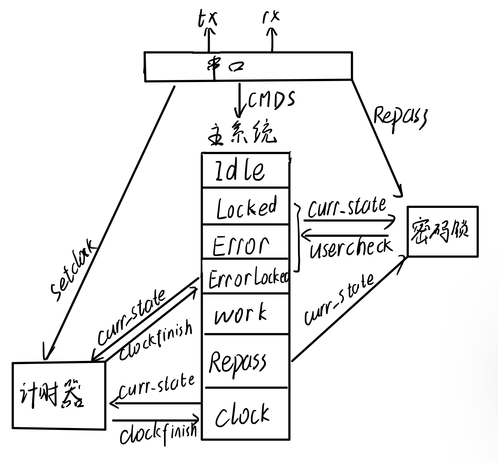

<div style="text-align:center;font-size:2em;font-weight:bold">中国科学技术大学计算机学院</div>


<div style="text-align:center;font-size:2em;font-weight:bold">《数字电路实验报告》</div>


<div style="display: flex;flex-direction: column;align-items: center;font-size:2em">
<div>
<p>实验题目：密码锁系统与计时器 </p>
<p>学生姓名：叶子昂</p>
<p>学生学号：PB20020586</p>
<p>完成时间：2021年12月13日</p>
</div>
</div>


<div style="page-break-after:always"></div>

## 实验题目
**密码锁系统与计时器**

## 摘要
​    **本次实验通过编写Verilog代码实现一个可通过串口交互的密码锁系统，同时系统包含更改密码，实现24小时以内任意计时的功能（可随时暂停和更改）。大部分交互通过串口完成。**

## 关键词

**串口，时序密码锁，计时器，状态机**

## 实验目的
* 复习前面所学知识
* 学习掌握串口的使用方法
* 利用verilog编写具有一定实用价值的电路
* 增强自己的实践应用能力

## 实验环境
* 有Windows系统的电脑，能连接校园网
* vivado配合vscode
* FPGA线上平台

## 用户手册
### 本系统能实现的功能
* 利用串口对系统进行操作，同时系统的部分回馈也通过串口返回。
* led显示当前系统状态，密码错误次数，密码验证状态(测试验证，如果实际使用应去掉)
* 类当前电子设备锁屏状态的解锁逻辑，密码由三个八位二进制数组成，依序输入能够成功解锁系统（初始密码为8'b0,8'b0,8'b0。密码错误系统会返回ERROR！连续错误3次系统会暂时锁定3分钟并通过数码管显示计时。
* 进入系统后，可以选择进入更改密码状态和计时器状态
  1. 更改密码状态下通过p "" "" ""(""中输入字符)重置密码，密码各位重置为字符对应的整型数字（ASCII码）
  2. 计时器状态下可通过s _ _ _ _ _ _(\_上输入数字)设置时间，时间设置完成后可通过button开始计时，sw[0]可随时开始或暂停计时，也可再次使用s指令重设时间再次计时。
* 提供各种指令以在系统状态间有条件的切换。
### 串口的指令
> 指令需严格与所给指令之一相同否则系统会返回ERROR！

<table>
        <tr>
            <th>指令</th>
            <th>作用</th>
            <th>指令</th>
            <th>作用</th>
        </tr>
        <tr>
            <th>start</th>
            <th>“唤醒”系统，使系统从IDLE进入LOCKED状态</th>
            <th>shutdown</th>
            <th>使进入系统WORK态回退到LOCKED状态</th>
        </tr>
        <tr>
            <th>reset</th>
            <th>使整个系统重置（不包括密码）</th>
            <th>check</th>
            <th>再输入密码完成后要求系统检查是否正确</th>
        </tr>
        <tr>
            <th>setcl</th>
            <th>在进入系统后转为计时器状态</th>
            <th>s 000000('0'可替换为24小时内符合时间格式的任意数字)</th>
            <th>再修改密码状态修改密码为符号对应的ASCII码</th>
        </tr>
        <tr>
            <th>setpa</th>
            <th>在进入系统后转为重置密码状态</th>
            <th>p # # #('#'可替换为任意字符)</th>
            <th>再修改密码状态修改密码为符号对应的ASCII码</th>
        </tr>
         <tr>
            <th>exit</th>
            <th>在重置密码状态或计时器状态回退到WORK状态</th>
            <th></th>
            <th></th>
        </tr>
    </table>

### 部分操作演示截图
1. **错误锁定**
   
2. **进入系统**
   
3. **计时器**
   
4. **修改密码**
   

## 实验设计
### 方案设计
1. **主系统状态机**
   			
1. **密码锁状态机**
        
3. **计时器**
   
4. **串口模块**
            
5. **模块间的交互**
        

### veilog代码实现
**topmodule部分基本声明**

```verilog
    parameter IDLE  = 4'd0;         //系统运行状态
    parameter LOCKED= 4'd1;
    parameter ERROR = 4'd2;
    parameter ERRORLOCKED= 4'd3;
    parameter WORK = 4'd4;
    parameter CLOCK = 4'd5;
    parameter REPASS = 4'd6;

    parameter passwordstate_F = 2'd0;//密码检查
    parameter passwordstate_S = 2'd1;
    parameter passwordstate_T = 2'd2;
    parameter passwordstate_E = 2'd3;

    reg usercheck;//密码正确
    reg er;//错误信号发出
    reg [1:0] error_cout;
    reg [3:0] curr_state;
    reg [3:0] next_state;

    wire is_reset_cmd; // 与串口交互指令
    wire is_check_cmd;
    wire is_start_cmd;
    wire is_setcl_cmd;
    wire is_exit_cmd;
    wire is_shutdown_cmd;
    wire is_setpa_cmd;
    wire is_check_cmd_cout;

    wire wr_rp;
    reg [1:0] inputcout;
    reg [1:0] pa_custate;
    reg [1:0] pa_nestate;
    wire [7:0] patemp[3:1];//串口数据接入
    reg [7:0] password1;
    reg [7:0] password2;
    reg [7:0] password3;

    wire wr_ry;
    reg [19:0] cout;
    reg [3:0] clock [7:0];
    wire [3:0] cltemp [6:1];//串口数据接入
    wire clockfinished;
    reg clockstart;
    reg pausecl;
    wire pulse_10hz;
```
1. **主状态机**
```verilog
   always@(posedge clk or posedge rst)//系统状态机
   begin
     if(rst)begin
         curr_state  <= IDLE;
     end
     else
         curr_state  <= next_state;
   end
   always@(*)
   begin
     if(rst)next_state=IDLE;
     else begin
     case(curr_state)
     IDLE: begin if(is_start_cmd) next_state=LOCKED; 
                 else next_state=IDLE; 
           end
     LOCKED: begin
         if(is_check_cmd) begin 
             if(usercheck) next_state=WORK; 
             else begin 
                 if(error_cout==2'd2) 
                     next_state = ERRORLOCKED;
                 else next_state = ERROR;
             end
         end
         else next_state=LOCKED;
     end
     ERROR:begin
         next_state = LOCKED;
     end
     ERRORLOCKED: begin
         if(clockfinished) 
              next_state = LOCKED;
         else next_state = ERRORLOCKED;
     end
     WORK: begin
         if(is_shutdown_cmd) 
             next_state = LOCKED;
         else if(is_setcl_cmd) 
             next_state = CLOCK; 
         else if(is_setpa_cmd) 
             next_state = REPASS;
         else next_state = WORK;
     end
     CLOCK:begin 
         if(is_exit_cmd) 
              next_state = WORK;
         else next_state = CLOCK;
     end
     REPASS: begin
         if(is_exit_cmd) 
              next_state = WORK;
         else next_state = REPASS;
     end
     default: next_state = IDLE; 
     endcase
   end
   end
```
2.**密码状态机**

```verilog
   always@(posedge clk or posedge rst)begin//nextstate and give usercheck
     if(rst)begin
         usercheck<=1'b0;
         pa_custate<=passwordstate_F;
     end
     else begin
         pa_custate<=pa_nestate;
         if(pa_custate==passwordstate_T&&pa_nestate==passwordstate_F) 
             usercheck<=1;
         else if(is_check_cmd) usercheck<=0;
         else if(usercheck&&button_edge) usercheck<=0;
     end
   end
   always@(posedge clk or posedge rst)begin//count the inputs
     if(rst)
         inputcout <= 2'b0;
     else begin
         if(button_edge)
         begin 
             inputcout<=inputcout+2'b1;
         end
     end
   end
   always@(posedge clk or posedge rst)begin//count the error times
     if(rst)error_cout<=2'b0;
     else if(curr_state!=LOCKED&&curr_state!=ERROR) 
         error_cout<=2'b0;
     else if(is_check_cmd_cout&&(usercheck==0))
     begin
         if(error_cout==2'd2)error_cout<=2'b0;
         else error_cout<=error_cout+2'b1;
     end
   end
   always@(*)begin
     if(is_check_cmd) pa_nestate=passwordstate_F;
     else if(button_edge&&curr_state==LOCKED)begin
         case(pa_custate)
         passwordstate_F: begin 
             if(sw==password1)
                 pa_nestate=passwordstate_S;
             else 
                 pa_nestate=passwordstate_E;
         end
         passwordstate_S: begin
             if(sw==password2)
                 pa_nestate=passwordstate_T;
             else 
                 pa_nestate=passwordstate_E;
         end
         passwordstate_T: begin
             if(sw==password3)
                 pa_nestate=passwordstate_F;
             else 
                 pa_nestate=passwordstate_E;
         end
         passwordstate_E: begin
             if(inputcout==2'd3)
                 pa_nestate=passwordstate_F;
             else 
                 pa_nestate=passwordstate_E;
         end
         default: pa_nestate=passwordstate_F;
         endcase
     end
     else pa_nestate=pa_custate;
   end
   always@(posedge clk)begin//reset the password
     if(curr_state == REPASS && wr_rp)begin
         password3 <= patemp[3];
         password2 <= patemp[2];
         password1 <= patemp[1];
     end
   end
```
3. **计时器**
``` verilog
    always@(posedge clk_n or posedge rst)                     
    begin
        if(rst)begin
            cout<=20'b0;
        end
        else begin
            if(cout>=20'd999999)
            cout<=20'b0;
            else cout<=cout+20'b1;
        end
    end
    assign pulse_10hz=(cout==20'd999999);//10hz
    always@(posedge clk)
    begin
        if(rst || clockfinished || (is_exit_cmd&&(curr_state==CLOCK))||(is_setcl_cmd)) 				  begin//reset the clock
            clock[0]<=4'b0;clock[1]<=4'b0;clock[2]<=4'b0;
            clock[3]<=4'b0;clock[4]<=4'b0;clock[5]<=4'b0;
            clock[6]<=4'b0;clock[7]<=4'b0;
            clockstart <= 1'b0;
        end
        else if(curr_state==CLOCK && button_edge)begin//计时器按button开始计时
            clockstart <= 1'b1;
        end
        else if(curr_state==CLOCK && wr_ry)begin//设置计数器计数时间
            clock[7]<=cltemp[1];clock[6]<=cltemp[2];clock[5]<=cltemp[3];
            clock[4]<=cltemp[4];clock[3]<=cltemp[5];clock[2]<=cltemp[6];
            clock[1]<=4'b0;
            clockstart <= 1'b0;
        end
        else if(curr_state==LOCKED && error_cout==2'd2)begin//errorlocked计时
            clock[4] <= 4'd3;
            clock[3] <= 4'd0;
            clock[2] <= 4'd0;
            clock[1] <= 4'd0;
            clockstart <=1'b1;
        end
        else
        begin//**计时**
        if(clockstart)
        begin
            if(pausecl==0)begin
                if(pulse_10hz)
                begin
                    if(clock[0]==4'b0)begin
                        clock[0] <= 4'd9;
                        if(clock[1]==4'b0)begin
                            clock[1]<= 4'd9;
                            if(clock[2]==4'b0)begin
                                clock[2]<= 4'd9;
                                if(clock[3]==4'b0)begin
                                    clock[3]<= 4'd5;
                                    if(clock[4]==4'b0)begin
                                        clock[4]<=4'd9;
                                        if(clock[5]==4'b0)begin
                                            clock[5]<= 4'd5;
                                            if(clock[6]==4'b0)begin
                                                clock[6]<= 4'd9;
                                                clock[7]<=clock[7]-4'b1;
                                            end
                                            else clock[6]<= clock[6]-4'b1;
                                        end
                                        else clock[5]<=clock[5]-4'b1;
                                    end
                                    else clock[4]<= clock[4]-4'b1;
                                end
                                else clock[3]<=clock[3]-4'b1;
                            end
                            else clock[2]<=clock[2]-4'b1;
                        end
                        else clock[1]<=clock[1]-4'b1;
                    end
                    else clock[0]<=clock[0]-4'b1;
                end
            end
        end
        end
    end
    assign clockfinished = ((clockstart)&&(clock[0]==0)&&(clock[1]==0)&&(clock[2]==0)&&(clock[3]==0)&&(clock[4]==0)&&
                            (clock[5]==0)&&(clock[6]==0)&&(clock[7]==0)&&(curr_state==CLOCK || curr_state==ERRORLOCKED));
    always@(posedge clk or posedge rst)begin
        if(rst)pausecl<=1'b0;
        else if(curr_state==CLOCK)
        begin
            if(sw[0])
                pausecl<=1'b1;
            else
                pausecl<=1'b0;
        end
        else pausecl<=1'b0;
    end
```
4. **串口调用模块**//省去了变量常量声明及对tx,rx模块的调用
``` verilog
    module iouart(
    input               clk,rst,
    input               rxuart,
    output              txuart,
    input               er,//topmodule的错误
    output              is_start_cmd,
    output              is_reset_cmd,
    output              is_check_cmd,
    output              is_setcl_cmd,
    output              is_setpa_cmd,
    output              is_exit_cmd,
    output              is_shutdown_cmd,
    output  reg               wr_ry,//设置时钟数据就绪
    output  reg[3:0]          clock1,
    output  reg[3:0]          clock2,
    output  reg[3:0]          clock3,
    output  reg[3:0]          clock4,
    output  reg[3:0]          clock5,
    output  reg[3:0]          clock6,
    output  reg               wr_rp,//设置密码数据就绪
    output  reg[7:0]          pa1,
    output  reg[7:0]          pa2,
    output  reg[7:0]          pa3
    );

    assign  is_s_cmd     = (curr_state==CMD_DC&&(rx_byte_buff_0=="s")&&(rx_byte_buff_1==" ")//
                        &&(rx_byte_buff_2>="0")&&(rx_byte_buff_2<="2")&&(rx_byte_buff_3>="0")&&
                        (rx_byte_buff_3<="9"))&&(rx_byte_buff_4>="0")&&(rx_byte_buff_4<="6")&&
                        (rx_byte_buff_5>="0")&&(rx_byte_buff_5<="9")&&(rx_byte_buff_6>="0")&&
                        (rx_byte_buff_6<="6")&&(rx_byte_buff_7>="0")&&(rx_byte_buff_7<="9");
    assign  is_p_cmd    = (curr_state==CMD_DC&&(rx_byte_buff_0=="p")&&(rx_byte_buff_1==" ")
                        &&(rx_byte_buff_3>=" ")&&(rx_byte_buff_5>=" "));
    assign  is_check_cmd = (curr_state==CMD_DC)&&(rx_byte_buff_0=="c")&&(rx_byte_buff_1=="h")
                        &&(rx_byte_buff_2=="e")&&(rx_byte_buff_3=="c")&&(rx_byte_buff_4=="k");
    assign  is_start_cmd = (curr_state==CMD_DC)&&(rx_byte_buff_0=="s")&&(rx_byte_buff_1=="t")
                        &&(rx_byte_buff_2=="a")&&(rx_byte_buff_3=="r")&&(rx_byte_buff_4=="t");
    assign  is_reset_cmd = (curr_state==CMD_DC)&&(rx_byte_buff_0=="r")&&(rx_byte_buff_1=="e")
                        &&(rx_byte_buff_2=="s")&&(rx_byte_buff_3=="e")&&(rx_byte_buff_4=="t");
    assign  is_setcl_cmd = (curr_state==CMD_DC)&&(rx_byte_buff_0=="s")&&(rx_byte_buff_1=="e")
                        &&(rx_byte_buff_2=="t")&&(rx_byte_buff_3=="c")&&(rx_byte_buff_4=="l");                 
    assign  is_exit_cmd = (curr_state==CMD_DC)&&(rx_byte_buff_0=="e")&&(rx_byte_buff_1=="x")
                        &&(rx_byte_buff_2=="i")&&(rx_byte_buff_3=="t");
    assign  is_shutdown_cmd = (curr_state==CMD_DC)&&(rx_byte_buff_0=="s")&&(rx_byte_buff_1=="h")
                        &&(rx_byte_buff_2=="u")&&(rx_byte_buff_3=="t")&&(rx_byte_buff_4=="d")
                        &&(rx_byte_buff_5=="o")&&(rx_byte_buff_6=="w")&&(rx_byte_buff_7=="n");
    assign  is_setpa_cmd = (curr_state==CMD_DC)&&(rx_byte_buff_0=="s")&&(rx_byte_buff_1=="e")
                        &&(rx_byte_buff_2=="t")&&(rx_byte_buff_3=="p")&&(rx_byte_buff_4=="a");    

    always@(posedge clk or posedge rst)
    begin
        if(rst)
            curr_state  <= IDLE;
        else
            curr_state  <= next_state;
    end
    always@(*)
    begin
        case(curr_state)
            IDLE:
                if((rx_vld==1'b1)&&(rx_data==8'h0a)) 
                    next_state  = CMD_DC;
                else
                    next_state  = IDLE;
            CMD_DC:
                if(rx_fifo_empty)
                begin
                    if(er)next_state  = CMD_ERR;
                    else if(is_s_cmd)            //转入设置时间
                        next_state  = CMD_CL;
                    else if(is_p_cmd)            //转入设置密码
                        next_state  = CMD_PA;
                    else if(is_check_cmd)        //接受指令交由topmodule处理
                        next_state = IDLE;
                    else if(is_start_cmd)        //
                        next_state = IDLE;
                    else if(is_reset_cmd)        //
                        next_state = IDLE;
                    else if(is_setcl_cmd)        //
                        next_state = IDLE; 
                    else if(is_setpa_cmd)        //
                        next_state = IDLE; 
                    else if(is_exit_cmd)         //
                        next_state = IDLE;
                    else if(is_shutdown_cmd)     //
                        next_state = IDLE;
                    else
                        next_state  = CMD_ERR;
                end
                else
                    next_state  = CMD_DC;
            CMD_CL:
                next_state  = IDLE;
            CMD_PA:
                next_state  = IDLE;
            CMD_ERR:
                next_state  = TXFIFO_WR;
            TXFIFO_WR:                        
                if(tx_byte_cnt==4'h0)
                    next_state = TXFIFO_WAIT;
                else
                    next_state = TXFIFO_WR;
            TXFIFO_WAIT:                      
                if(tx_fifo_empty)
                    next_state = IDLE;
                else
                    next_state = TXFIFO_WAIT;
            default:
                next_state      = IDLE;
        endcase
    end

    always@(posedge clk or posedge rst)//get new password
    begin
        if(rst)
        begin
            wr_rp   <= 1'b0;
            pa1 <=0;pa2<=0;pa3<=0;
        end
        else if(curr_state == CMD_PA)
        begin
            wr_rp   <= 1'b1;
            pa1 <= rx_byte_buff_2;
            pa2 <= rx_byte_buff_4;
            pa3 <= rx_byte_buff_6;
        end
        else
        begin
            wr_rp   <= 1'b0;
            pa1 <= 0;
            pa2 <= 0;
            pa3 <= 0;
        end
    end    

    always@(posedge clk or posedge rst)// get clock data
    begin
        if(rst)
        begin
            wr_ry   <= 1'b0;
            clock1 <=0;clock2<=0;clock3<=0;
            clock4 <=0;clock5<=0;clock6<=0;
        end
        else if(curr_state == CMD_CL)
        begin
            wr_ry   <= 1'b1;
            clock1 <= rx_byte_buff_2-8'd48;
            clock2 <= rx_byte_buff_3-8'd48;
            clock3 <= rx_byte_buff_4-8'd48;
            clock4 <= rx_byte_buff_5-8'd48;
            clock5 <= rx_byte_buff_6-8'd48;
            clock6 <= rx_byte_buff_7-8'd48;
        end
        else
        begin
            wr_ry   <= 1'b0;
            clock1 <= 0;
            clock2 <= 0;
            clock3 <= 0;
            clock4 <= 0;
            clock5 <= 0;
            clock6 <= 0;
        end
    end    

    always@(posedge clk or posedge rst)
    begin
        if(rst)
        begin
            tx_fifo_wr_en   <= 1'b0;
            tx_fifo_din     <= 8'h0;
        end
        else if(curr_state==TXFIFO_WR)
        begin
            tx_fifo_wr_en   <= 1'b1;
            case(tx_byte_cnt)
                4'h6:   tx_fifo_din <= tx_byte_buff_6;
                4'h5:   tx_fifo_din <= tx_byte_buff_5;
                4'h4:   tx_fifo_din <= tx_byte_buff_4;
                4'h3:   tx_fifo_din <= tx_byte_buff_3;
                4'h2:   tx_fifo_din <= tx_byte_buff_2;
                4'h1:   tx_fifo_din <= tx_byte_buff_1;
                4'h0:   tx_fifo_din <= tx_byte_buff_0;
                default:tx_fifo_din <= 8'h0;
            endcase
        end
        else
        begin
            tx_fifo_wr_en   <= 1'b0;
            tx_fifo_din     <= 8'h0;
        end
    end

    always@(posedge clk or posedge rst)
    begin
        if(rst)
            tx_byte_cnt <= 4'h0;
        else if(curr_state==IDLE)
            tx_byte_cnt <= 4'h0;
        else if(curr_state==CMD_ERR)
            tx_byte_cnt <= 4'h6;
        else if(curr_state==TXFIFO_WR)
        begin
            if(tx_byte_cnt!=4'h0)
                tx_byte_cnt <= tx_byte_cnt - 4'h1;
        end
    end

    //***********************************************************以下为复用示例代码
    always@(posedge clk or posedge rst)
    begin
        if(rst)
        begin
            tx_byte_buff_0  <= 8'h0;
            tx_byte_buff_1  <= 8'h0;
            tx_byte_buff_2  <= 8'h0;
            tx_byte_buff_3  <= 8'h0;
            tx_byte_buff_4  <= 8'h0;
            tx_byte_buff_5  <= 8'h0;
            tx_byte_buff_6  <= 8'h0;
            tx_byte_buff_7  <= 8'h0;
        end
        else if(curr_state==IDLE)
        begin
            tx_byte_buff_0  <= 8'h0;
            tx_byte_buff_1  <= 8'h0;
            tx_byte_buff_2  <= 8'h0;
            tx_byte_buff_3  <= 8'h0;
            tx_byte_buff_4  <= 8'h0;
            tx_byte_buff_5  <= 8'h0;
            tx_byte_buff_6  <= 8'h0;
            tx_byte_buff_7  <= 8'h0;
        end
        else if(curr_state==CMD_ERR)
        begin
            tx_byte_buff_6  <= "E";
            tx_byte_buff_5  <= "R";
            tx_byte_buff_4  <= "R";
            tx_byte_buff_3  <= "O";
            tx_byte_buff_2  <= "R";
            tx_byte_buff_1  <= "!";
            tx_byte_buff_0  <= "\n";
        end
    end

    always@(posedge clk or posedge rst)
    begin
        if(rst)
            rx_fifo_en  <= 1'b0;
        else if(curr_state==CMD_DC)
            rx_fifo_en  <= 1'b1;
        else
            rx_fifo_en  <= 1'b0;
    end
    always@(posedge clk or posedge rst)//接收计数，并用于对命令中的各字节编号
    begin
        if(rst)
            rx_byte_cnt <= 4'h0;
        else if(curr_state==CMD_DC)
        begin
            if((rx_fifo_en)&&(rx_fifo_empty==1'b0)&&(rx_byte_cnt<4'hf))
                rx_byte_cnt <= rx_byte_cnt + 4'b1;
        end
        else
            rx_byte_cnt <= 4'h0;
    end
    always@(posedge clk or posedge rst)
    begin
        if(rst)
        begin
            rx_byte_buff_0  <= 8'h0;
            rx_byte_buff_1  <= 8'h0;
            rx_byte_buff_2  <= 8'h0;
            rx_byte_buff_3  <= 8'h0;
            rx_byte_buff_4  <= 8'h0;
            rx_byte_buff_5  <= 8'h0;
            rx_byte_buff_6  <= 8'h0;
            rx_byte_buff_7  <= 8'h0;
        end
        else if(curr_state==IDLE)
        begin
            rx_byte_buff_0  <= 8'h0;
            rx_byte_buff_1  <= 8'h0;
            rx_byte_buff_2  <= 8'h0;
            rx_byte_buff_3  <= 8'h0;
            rx_byte_buff_4  <= 8'h0;
            rx_byte_buff_5  <= 8'h0;
            rx_byte_buff_6  <= 8'h0;
            rx_byte_buff_7  <= 8'h0;
        end
        else if(curr_state==CMD_DC)
        begin
            case(rx_byte_cnt)
                4'h0:   rx_byte_buff_0 <= rx_fifo_data;
                4'h1:   rx_byte_buff_1 <= rx_fifo_data;
                4'h2:   rx_byte_buff_2 <= rx_fifo_data;
                4'h3:   rx_byte_buff_3 <= rx_fifo_data;
                4'h4:   rx_byte_buff_4 <= rx_fifo_data;
                4'h5:   rx_byte_buff_5 <= rx_fifo_data;
                4'h6:   rx_byte_buff_6 <= rx_fifo_data;
                4'h7:   rx_byte_buff_7 <= rx_fifo_data;
            endcase
        end
    end 
    endmodule
```
5. **串口发送和接收模块——学习后直接使用教师示例代码**tx,rx

## **实验中遇到的一些问题**
* 由于实验涉及到的状态机不少，理清各个状态机在不同信号下的现态与次态有一定难度，实验中多次出现部分状态机转化时机不对，至使整个系统产生意外甚至令人费解的输出，先理清状态转化而非盲目写代码有效减少该类问题的产生。
* 串口中的CMD信号在判断为真时会持续两个时钟周期导致在利用这些信号进行计数相关操作和部分状态机转换时会出现错误计数情况，通过取信号边沿后使用可解决该问题。
* 由于串口传输的特殊性，串口信号需要一定的时间才能有效而非主模块需求时能立刻获得，此时主模块应在适宜时机等待串口信号到来后再响应其他信号。

## **有待进一步优化和提升的地方**
* 串口命令的格式要求过于严格,或许可通过代码内部增加判断实现自动忽略空格和补0,应会带来更方便的操作
* 可以在进入系统后添加更多的功能如：LC3模拟器，小游戏...。
* 可以为系统添加更为丰富的IO接口以实现更为丰富的输入输出如键盘输入和VGA视频输出。

## 总结与思考
* l本次实验的收获
  * 通过本次实验进一步熟悉了利用FPGA在线平台完成FPGA开发的流程。
  * 深入的复习和综合运用前面实验的知识和技巧。
  * 实验中也遇到一些平常未见的错误，通过网络及论坛解决学习了了如fifo(先进先出存储器)的使用方法及出现的问题
  * 有效锻炼了我分析问题现象，结合vivado的critical warning利用多种手段定位解决问题的能力。
  * 学习掌握了串口的使用方法，能够利用串口进行简单的IO操作。
  * 能够利用有限状态机并进行组合实现功能较为完善的电路。
* 本次实验的难易程度
    本次实验涉及较多的状态机和状态机的交互，对个人来说难度较大。
* 本次实验的任务量
	综合实验设计内容较多，代码量较大，设计和调试繁复不少总体任务量大，所花时间较长
* 对本次实验的建议
	希望在第十次实验时能实际演示一下所给出的IO设备的使用方法和效果。
